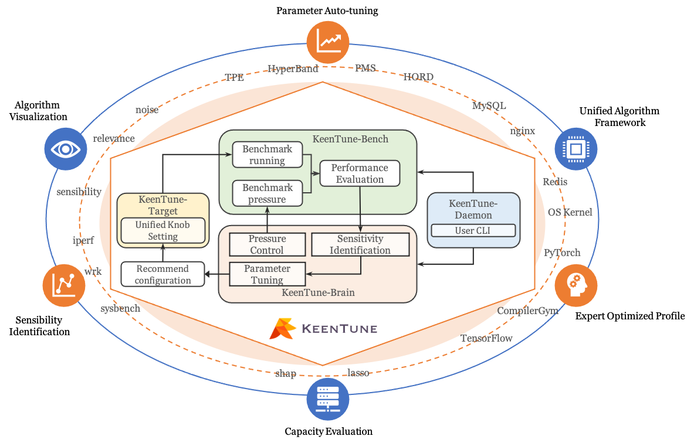

# User Guide of KeenTune
## 1. Overview
### 1.1. Introduction
KeenTune是一种全栈auto-tuning工具，通过调整应用程序旋钮和内核参数来优化应用程序性能。作为一种轻量级且灵活的工具，KeenTune可以与待调优的应用程序一起部署，对其性能的影响可以忽略不计。  
KeenTune的核心思想是同时调整应用程序端和内核端的参数，并通过使用解释算法识别敏感参数来降低搜索空间，该算法有助于解释任意机器学习模型。    
具体来说，KeenTune首先收集一组参数值及其相应的性能评估结果，以最初构建可以用不同机器学习模型实现的代理。该初始数据集还用于使用可解释的机器学习算法估计每个参数的灵敏度。   
然后，KeenTune使用预先指定的调优算法迭代推荐候选参数配置，并执行选定的基准工具来评估目标应用程序的性能。评估结果将反馈给调整算法，以调整其搜索策略。  
最后，KeenTune将优化的参数配置保存为profile文件。profile文件可以快速设置为要优化的环境，或用作连续调优的新优化基线。  

KeenTune is an collaborative full-stack auto-tuning tool that optimize application performance by tuning both application knobs and kernel knobs. KeenTune is a lightweight and flexible tool that can be deployed with to-be-tuned applications with negligible impact on their performance.  
The core idea of KeenTune is to tune full-stack knobs from both application-side and kernel-side collaboratively and reduce the search space by identifying sensitive knobs with an explaining algorithm which helps interpret arbitrary machine learning models.   
Specifically, KeenTune first collect a set of knob values and their corresponding performance values to initially build a surrogate that can be implemented with different machine learning models. This initial set of data is also used to estimate the sensitivity of each knob with an explainable machine learning algorithm.   
Then KeenTune uses a pre-specified tuning algorithm to iteratively recommend candidate knob configurations and executes a selected benchmark tool to evaluate the performance of the target application. The evaluation result is fed to the tuning algorithm to adjust its search strategy. 
At last, KeenTune saves the optimized knob configuration as a profile file. This profile can be quickly set to the environment to be optimized or used as a new optimization baseline for continuous tuning.  

### 1.2. Architecture
  
如图所示，我们在KeenTune中实现了四个模块: daemon, brain, target and bench.  
daemon模块是控制模块，用于在tuning运行时安排和监控其他模块，用户可以定义需要进行tuning的参数及其取值范围，以及一个benchmark脚本.
brain集成了多种tuning算法，包括BO、Tree-structured Parzen Estimator(TPE), HORD, BOHB以及包括Lasso和SHAP在内的旋钮灵敏度识别算法。该模块通过RESTful API提供算法服务。具体来说，在tuning过程中，brain模块向target模块提供推荐的参数配置，并从bench模块接收性能指标。 在敏感度识别过程中，brain模块使用tuning提供的中间数据来识别敏感参数.
bench模块运行benchmark脚本，获得代表应用性能的指标值，并将其送回brain模块。target模块负责应用推荐的参数配置，并维护默认的参数配置值，可以随时还原调优环境到初始配置.  

As shown in figure, we implement four modules in KeenTune: daemon, brain, target and bench.  
The daemon module is the control module to schedule and monitor other modules when tuning runs, that users can identify the to-be-tuned knobs with their tunable ranges and a benchmark with executable scripts.  
The brain module integrates several tuning algorithm including Gaussian process based BO, Tree-structured Parzen Estimator(TPE), HORD, BOHB, and knob sensitivity identification algorithm including Lasso and SHAP. This module provides algorithm services through the RESTful API. Specifically, in the tuning process, the brain module provides recommended knob configuration to the target module and receives performance metrics from the bench module.  In the sensitivity identification process, the brain module uses intermediate data to identify and return sensitive knobs to users.  
The bench module runs benchmark tools to obtain a metric value that represents the application performance and send it back to the brain module.   
The target module is responsible for applying the recommended knob configuration and maintaining the default knob application to support the recovery of the auto-tuning environment.   

## 2. Primary Function
### 2.1. Parameters Auto-tuning
### 2.2. Expert Optimized Profile
### 2.3. Sensibility identification
### 2.4. Capacity Evaluation
### 2.5. Unified Algorithm Framework
### 2.6. Algorithm Visualization

## 3. Installation and Deployment
### 3.1. Dependencies
### 3.2. Installation
### 3.3. Configuration
